# Server Dependency Graph (DAG)

## Overview

This document provides a Directed Acyclic Graph (DAG) of the server architecture, showing dependencies between crates, modules, and systems. The graph ensures no circular dependencies and provides a clear view of the build order and module relationships.

## High-Level Crate Dependencies

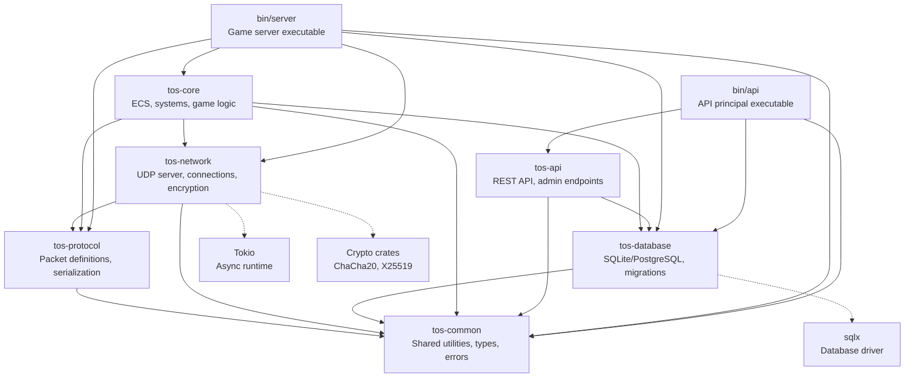

## Detailed Module Dependencies

### tos-common (Base Layer)

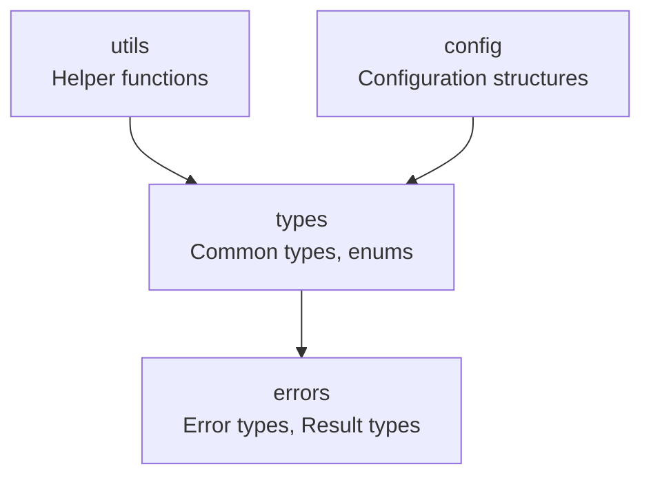

### tos-protocol (Protocol Layer)

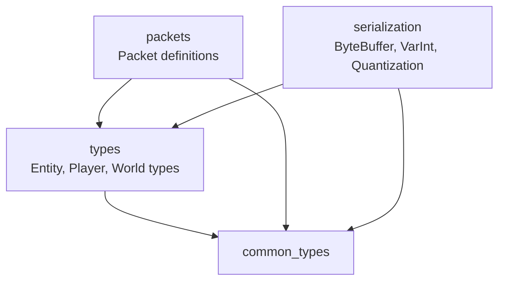

### tos-network (Network Layer)

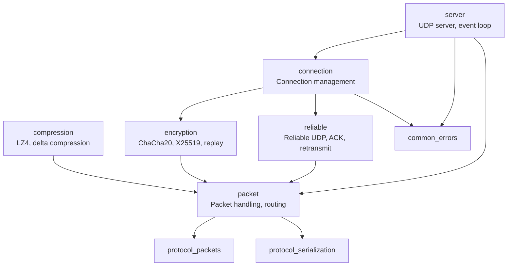

### tos-database (Database Layer)

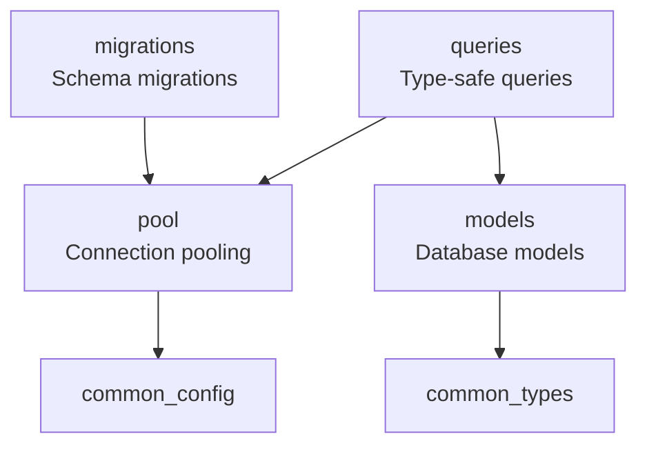

### tos-core (Core Game Logic)

```mermaid
graph TD
    %% ECS Framework
    ecs_entity[ecs/entity<br/>Entity ID management]
    ecs_component[ecs/component<br/>Component storage SoA]
    ecs_system[ecs/system<br/>System trait, scheduler]
    ecs_query[ecs/query<br/>Query system]
    ecs_world[ecs/world<br/>ECS World]
    
    ecs_component --> ecs_entity
    ecs_system --> ecs_component
    ecs_system --> ecs_query
    ecs_query --> ecs_component
    ecs_world --> ecs_system
    ecs_world --> ecs_query
    
    %% Components
    comp_transform[components/transform<br/>Position, rotation]
    comp_health[components/health<br/>Health, mana, stamina]
    comp_stats[components/stats<br/>Character stats]
    comp_combat[components/combat<br/>Combat state]
    comp_inventory[components/inventory<br/>Inventory, equipment]
    comp_player[components/player<br/>Player-specific]
    
    comp_transform --> ecs_component
    comp_health --> ecs_component
    comp_stats --> ecs_component
    comp_combat --> ecs_component
    comp_inventory --> ecs_component
    comp_player --> ecs_component
    
    %% Systems
    sys_movement[systems/movement<br/>Movement system]
    sys_combat[systems/combat<br/>Combat system]
    sys_ai[systems/ai<br/>AI system]
    sys_conditions[systems/conditions<br/>Condition system]
    sys_buffs[systems/buffs<br/>Buff/debuff system]
    sys_respawn[systems/respawn<br/>Respawn system]
    
    sys_movement --> ecs_world
    sys_movement --> comp_transform
    sys_combat --> ecs_world
    sys_combat --> comp_combat
    sys_combat --> comp_health
    sys_ai --> ecs_world
    sys_ai --> comp_transform
    sys_conditions --> ecs_world
    sys_conditions --> comp_health
    sys_buffs --> ecs_world
    sys_buffs --> comp_stats
    sys_respawn --> ecs_world
    sys_respawn --> comp_health
    
    %% World Management
    world_map[world/map<br/>Map management]
    world_aoi[world/aoi<br/>Area of Interest]
    world_spatial[world/spatial<br/>Spatial partitioning]
    
    world_map --> ecs_world
    world_aoi --> world_spatial
    world_aoi --> ecs_world
    world_spatial --> ecs_world
    
    %% Combat Mechanics
    combat_damage[combat/damage<br/>Damage calculation]
    combat_skills[combat/skills<br/>Skill system]
    combat_actions[combat/actions<br/>Action system]
    
    combat_damage --> comp_stats
    combat_damage --> comp_combat
    combat_skills --> comp_stats
    combat_actions --> combat_skills
    combat_actions --> protocol_packets
    
    %% Player Systems
    player_progression[player/progression<br/>Level, XP]
    player_skills[player/skills<br/>Skill progression]
    player_quests[player/quests<br/>Quest system]
    
    player_progression --> comp_player
    player_skills --> comp_stats
    player_quests --> comp_player
    
    %% Telemetry
    telemetry_collector[telemetry/collector<br/>Metrics collector]
    telemetry_metrics[telemetry/metrics<br/>Metrics definitions]
    telemetry_hardware[telemetry/hardware<br/>CPU, memory]
    telemetry_network[telemetry/network<br/>Network metrics]
    telemetry_performance[telemetry/performance<br/>FPS, tick rate]
    telemetry_exporter[telemetry/exporter<br/>Prometheus export]
    
    telemetry_collector --> telemetry_metrics
    telemetry_hardware --> telemetry_collector
    telemetry_network --> telemetry_collector
    telemetry_performance --> telemetry_collector
    telemetry_exporter --> telemetry_collector
    
    %% Core dependencies on other crates
    tos_core --> protocol_packets
    tos_core --> network_connection
    tos_core --> db_queries
    sys_movement --> network_packet
    sys_combat --> network_packet
    combat_actions --> network_packet
```

### tos-api (API Principal)

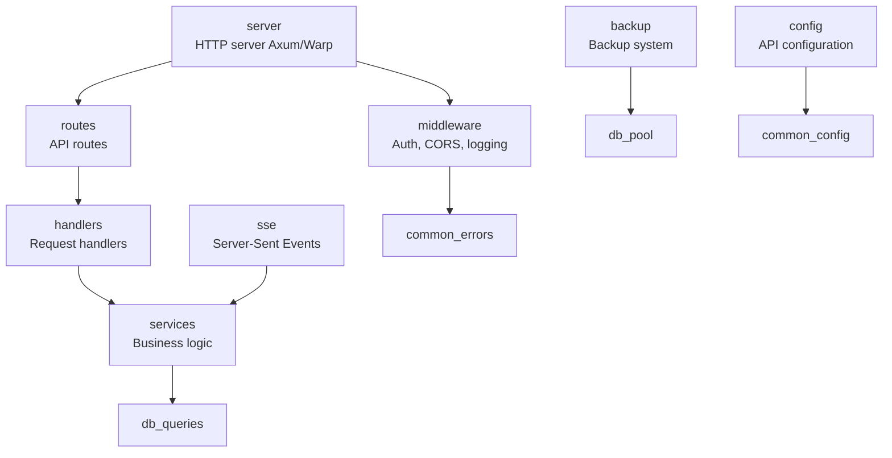

## System Execution Flow

### Game Server Startup

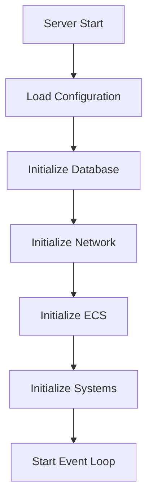

### Packet Processing Flow

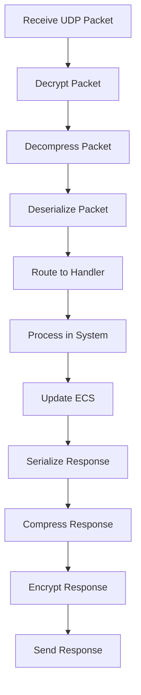

### ECS System Execution

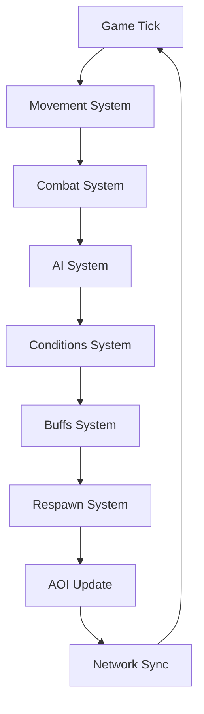

## Dependency Rules

### Build Order

1. **tos-common** - No dependencies on other project crates
2. **tos-protocol** - Depends only on tos-common
3. **tos-database** - Depends only on tos-common
4. **tos-network** - Depends on tos-protocol and tos-common
5. **tos-core** - Depends on tos-protocol, tos-network, tos-database, and tos-common
6. **tos-api** - Depends on tos-database and tos-common
7. **bin/server** - Depends on all game server crates
8. **bin/api** - Depends on tos-api, tos-database, and tos-common

### Circular Dependency Prevention

**Rules:**
- Lower-level crates cannot depend on higher-level crates
- `tos-common` has no dependencies on other project crates
- `tos-protocol` only depends on `tos-common`
- `tos-network` depends on `tos-protocol` but not `tos-core`
- `tos-core` can depend on all lower-level crates
- `tos-api` is independent of game server crates (only database)

**Forbidden Dependencies:**
- ❌ `tos-common` → any other crate
- ❌ `tos-protocol` → `tos-network` or `tos-core`
- ❌ `tos-network` → `tos-core`
- ❌ `tos-database` → `tos-core` or `tos-network`
- ❌ `tos-api` → `tos-core` or `tos-network`

## Module Import Guidelines

### tos-common
```rust
// Only external dependencies
use std::...;
use serde::...;
```

### tos-protocol
```rust
// Can import from tos-common
use tos_common::types::...;
use tos_common::errors::...;
```

### tos-network
```rust
// Can import from tos-protocol and tos-common
use tos_protocol::packets::...;
use tos_protocol::serialization::...;
use tos_common::errors::...;
```

### tos-core
```rust
// Can import from all lower-level crates
use tos_protocol::packets::...;
use tos_network::connection::...;
use tos_database::queries::...;
use tos_common::types::...;
```

### tos-api
```rust
// Can import from tos-database and tos-common
use tos_database::queries::...;
use tos_database::models::...;
use tos_common::errors::...;
```

## Testing Dependencies

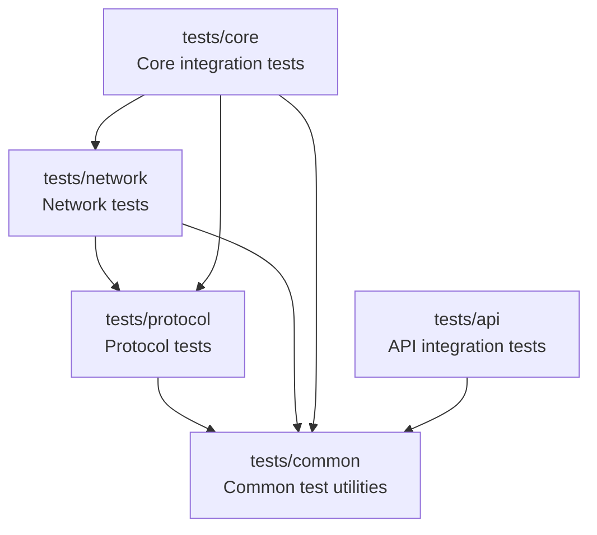

## See Also

- [STRUCTURE_RECOMMENDATIONS.md](../STRUCTURE_RECOMMENDATIONS.md) - Detailed structure recommendations
- [ARCHITECTURE.md](./ARCHITECTURE.md) - Complete architecture documentation
- [ROADMAP.md](./ROADMAP.md) - Implementation roadmap

